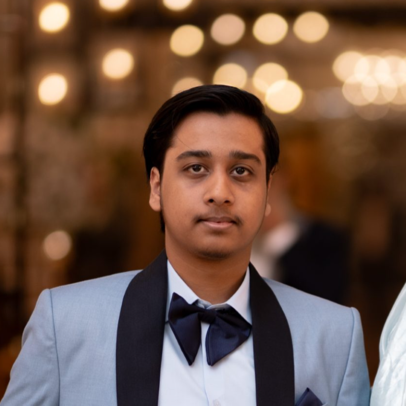
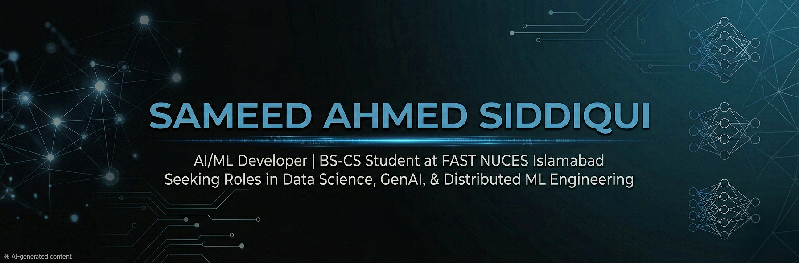

## Hi there 👋

<!--
**sameed-as/sameed-as** is a ✨ _special_ ✨ repository because its `README.md` (this file) appears on your GitHub profile.

Here are some ideas to get you started:

- 🔭 I’m currently working on ...
- 🌱 I’m currently learning ...
- 👯 I’m looking to collaborate on ...
- 🤔 I’m looking for help with ...
- 💬 Ask me about ...
- 📫 How to reach me: ...
- 😄 Pronouns: ...
- ⚡ Fun fact: ...
-->
<!-- Flex Header Layout for Headshot and Name -->
<table border="0" cellpadding="0" cellspacing="0">
  <tr>
    <td width="150" align="center" valign="middle">
      
    </td>
    <td valign="middle" style="padding-left: 20px;">
      <h1>Hi there, I'm Sameed Ahmed Siddiqui 👋</h1>
      
<strong>AI/ML & Intelligent Systems Developer | BS-CS Student at FAST NUCES Islamabad</strong>

    </td>
  </tr>
</table>

<!-- Centered Profile Banner -->

  

## 🚀 About Me
I am a Computer Science professional finishing my undergraduate studies at **FAST-NUCES Islamabad**. My passion lies at the intersection of building robust, large-scale data engineering infrastructures and deploying production-ready generative AI multi-agent pipelines. 

- 🎓 **Education:** BS in Computer Science (GPA: 3.41)
- 💼 **Latest Experience:** Data Science Intern at Asiacell PJSC (Sulaymaniyah, Iraq)
- 🛠️ **Core Focus:** Full-Stack Web Development, Data Science, GenAI, and Distributed Systems

---

## 🛠️ Tech Stack & Toolkit

| Category | Technologies |
| :--- | :--- |
| **Languages** | Python, Java, C/C++, SQL, JavaScript, HTML/CSS |
| **Frameworks & AI** | PyTorch, LangGraph, LangChain, FastAPI, Flask, Next.js, React, MLflow |
| **Data & DevOps** | Apache Spark, Apache Kafka, Apache Storm, Docker, Apache Airflow, Git |

---

## 🏗️ Featured Engineering Projects

### 🛡️ [FakeLess (CloneShield)](https://github.com/sameed-as/FakeLess)
*My Final Year Project focused on anti-audio deepfake defense systems.*
- Developed a 1D U-Net and FilterNet optimization pipeline to inject $L_\infty$-bounded perturbations, proactively neutralizing XTTSv2 voice cloning hooks.
- Built an agentic Flutter mobile application communicating with a memory-optimized FastAPI backend wrapper.

### 🤖 [ContentAI Multi-Agent Pipeline](https://github.com/sameed-as/ContentAI)
*A localized, production-ready content automation generation engine.*
- Architected a multi-agent state workflow via LangGraph to split tasks across autonomous understanding and drafting nodes.
- Integrated containerized local Llama 3.2 models running through Ollama, utilizing a ChromaDB vector index for strict template formatting enforcement.

### 📊 [Real-Time Crime Analytics Layer](https://github.com/sameed-as/crime-analytics-lambda)
*A high-velocity, cross-platform Lambda Architecture processing live engine streams.*
- Built a dual-layer streaming pipeline handling 100 events/second using Apache Kafka and Apache Storm alongside historical PySpark batch arrays.
- Successfully migrated the infrastructure out of Ubuntu VM environments directly into native Windows clusters using custom PowerShell orchestrations.

---

## 📈 GitHub Stats

  
  

---

## 🤝 Connect with Me
- 💼 **LinkedIn:** [linkedin.com/in/sameedasiddiqui](https://linkedin.com/in/sameedasiddiqui/)
- 📧 **Email:** [sameed.siddique123@gmail.com](mailto:sameed.siddique123@gmail.com)
- 🌐 **Portfolio Portal:** [sameed-as.github.io](https://sameed-as.github.io)
